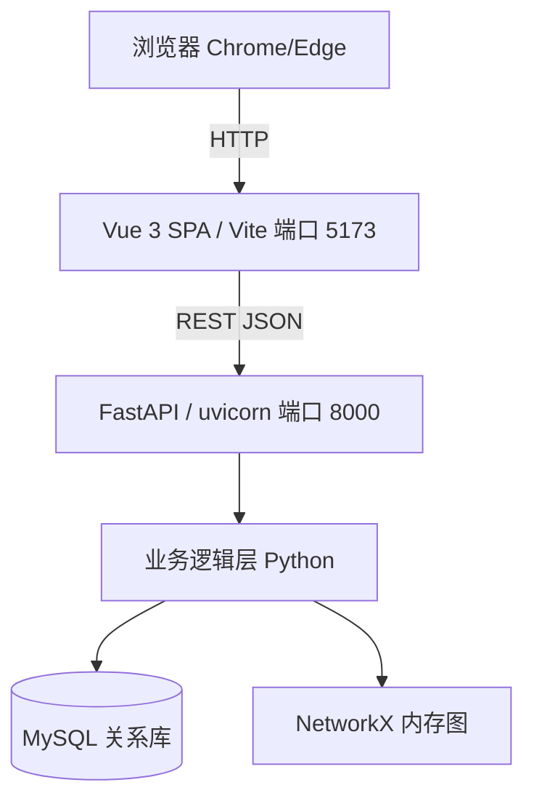

## 用户需求

将"基于知识图谱的医疗文献管理平台"项目文档中的技术架构，由原有的 **Streamlit 前端 + Flask REST API 后端** 修改为 **Vue 3 前端 + FastAPI 后端**。数据层（MySQL 关系库）与图计算层（NetworkX 内存图）保持不变，业务逻辑层（Python + jieba + NER）保持不变。

## 产品概述

本次为纯文档修订任务，不编写任何源码、不创建项目骨架、不运行服务。需将 Markdown 设计/计划文档与对应的 Word 副本中的前端、后端框架描述一致、完整地切换为 Vue + FastAPI，并同步修正架构图、目录结构、模块职责、技术栈、人员分工与风险评估等关联内容。

## 核心特性

- 表示层：Streamlit → Vue 3（SPA，Vite 构建）；力导向图可视化由 pyecharts 改为浏览器端 ECharts（vue-echarts）
- API/业务接入层：Flask → FastAPI（uvicorn 运行）；REST 路由路径保持不变（/api/query/entity、/api/query/top、/api/query/path、/api/query/article、/api/search）
- 同步改写架构图、目录结构、模块四（Web 交互界面模块）、技术栈行、成员分工、任务名称与风险描述

## 技术栈选择

- 目标架构（与用户确认）：前端 Vue 3 + Vite（SPA），后端 FastAPI + uvicorn（REST API），数据/图计算 MySQL + NetworkX，可视化 ECharts / vue-echarts。
- 修订工具：Markdown 文档直接文本编辑；Word 副本使用 python-docx（经由 [skill:docx] 处理）。
- 不引入新代码文件、requirements.txt 或运行环境变更。

## 实现方案

- 策略：对每个文档采用"定点语义改写 + 关键词替换"结合。架构图、目录结构、模块职责等结构性内容必须语义化重写（不可纯字符串替换，否则会破坏层级关系）；技术栈、分工、风险等列表项可直接做关键词替换。
- 统一替换映射（所有文档保持一致）：
- `Streamlit` → `Vue`（首次出现处用"Vue 3"）
- `Flask` → `FastAPI`
- `Streamlit Pages + Flask API Routes` → `Vue 前端 + FastAPI 后端`
- `pyecharts` / `ECharts（pyecharts）` → `ECharts（vue-echarts / ECharts JS）`
- 目录结构：`src/web/app.py`(Streamlit) → `frontend/`（Vue 项目）；`src/web/api.py`(Flask) → `src/api/main.py`(FastAPI)
- 模块四：标题改为"前端 Vue + 后端 FastAPI 模块"；`SearchPage/GraphPage/DetailPage` 改为 `Search.vue/Graph.vue/Detail.vue`；`FlaskAPI（REST API）` 路由表改为 `FastAPI 路由（REST API）`
- 成员C 分工、任务名称、风险"MySQL + Streamlit 集成复杂度" → "MySQL + FastAPI 集成复杂度"

## 实现要点

- 架构图需重写表示层与通信链路：浏览器 → Vue（HTTP）→ FastAPI（REST JSON）→ 业务层 → MySQL/NetworkX。
- Word 副本沿用此前 Neo4j→MySQL 替换的 python-docx 思路，但对架构/技术栈段落需读取后语义化改写，保留原有标题、表格与编号结构。
- 不修改 `.doc` 旧模板与 `实训案例.md`（无相关词）；保持文档其余内容（Neo4j→MySQL 已完成的变更）不变。

## 目标架构图



## 目录结构（需修改的文件）

```
marckdown文件/
├── 系统概要设计说明书_草案.md   # [MODIFY] 关键词/摘要/架构图/目录结构/模块四/系统信息
├── 需求规格说明书.md            # [MODIFY] 关键词/摘要/2.1.1/2.2/3.1 用例图
├── 项目计划.md                  # [MODIFY] 项目目标/技术栈/任务表/成员C分工
└── 项目立项报告.md              # [MODIFY] 功能描述/技术栈/分工表/风险
巩固式解密模板/
├── 01_项目立项/
│   └── KJTP-MLM-001_Project Start Report_V1.0_副本.docx  # [MODIFY] 架构/技术栈/分工
└── 02_项目计划/
    └── KJTP-MLM-001_SPP_V1.0_副本.docx                   # [MODIFY] 架构/技术栈/任务
```

## Agent Extensions

### Skill

- **docx**
- 用途：编辑两个 Word 副本（KJTP-MLM-001_Project Start Report_V1.0_副本.docx、KJTP-MLM-001_SPP_V1.0_副本.docx），完成 Streamlit→Vue、Flask→FastAPI 替换，并对架构/技术栈段落做语义化改写。
- 预期结果：两个 docx 的架构、技术栈、分工描述与对应 Markdown 文档完全一致，标题/表格/编号格式保持不变。