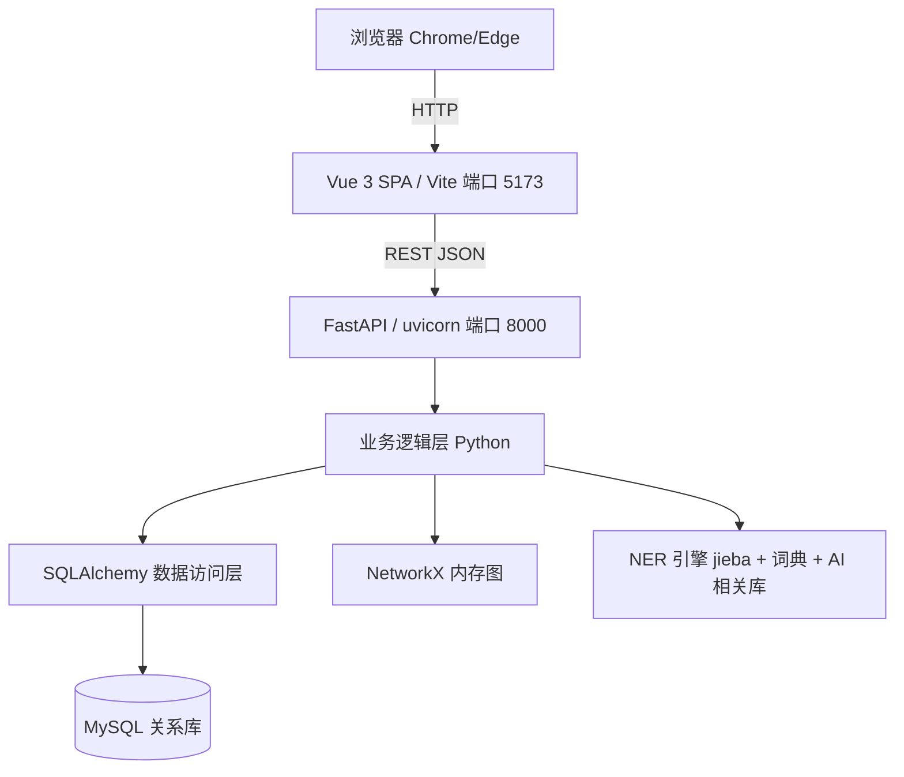

## 产品概述

本任务为纯文档修订，将"基于知识图谱的医疗文献管理平台"项目设计文档的技术架构，由原有的 **Streamlit 前端 + Flask 后端 + pymysql 直连** 统一切换为 **Vue 3 前端 + FastAPI 后端（SQLAlchemy ORM + AI 相关库）+ MySQL + NetworkX**。不编写任何源码、不创建项目骨架、不运行服务。

## 核心特性

- 表示层：Streamlit → Vue 3（SPA，Vite 构建）；力导向图可视化由 pyecharts 改为浏览器端 ECharts（vue-echarts）
- API 层：Flask → FastAPI（uvicorn 运行）；REST 路由路径保持不变（/api/query/entity、/api/query/top、/api/query/path、/api/query/article、/api/search）
- 数据访问层：pymysql 直连 → SQLAlchemy ORM 访问 MySQL（新增 SQLAlchemy 引擎/会话管理层）
- 实体识别：在 jieba + 词典匹配基础上，补充引入 AI 相关库（如 transformers / spaCy）增强识别
- 图计算层：NetworkX 内存图保持不变
- 同步改写架构图、目录结构、模块职责、技术栈、人员分工与风险评估等关联内容

## 技术栈选择

- 前端：Vue 3 + Vite（SPA），可视化使用 ECharts / vue-echarts（替代原 pyecharts）
- 后端：FastAPI + uvicorn（REST API，替代原 Flask）
- 数据访问：SQLAlchemy ORM（替代原 pymysql 直连），底层仍为 MySQL 关系型数据库
- 图计算：NetworkX 内存图（不变）
- 实体识别：jieba + 医学词典匹配 + AI 相关库（transformers / spaCy 等预训练模型库，文档中以示例列出，实现阶段可最终确定）
- 修订工具：Markdown 直接文本编辑；Word 副本使用 python-docx（经由 [skill:docx] 处理）
- 不引入新代码文件、requirements.txt 或运行环境变更

## 实现方案

- 策略：对每个文档采用"定点语义改写 + 关键词替换"结合。架构图、目录结构、模块职责、NER 与数据访问层说明等结构性内容必须语义化重写（不可纯字符串替换，否则破坏层级与含义）；技术栈、分工、风险等列表项可直接做关键词替换。
- 统一替换映射（所有文档保持一致）：
- `Streamlit` → `Vue`（首次出现用"Vue 3"）
- `Flask` → `FastAPI`
- `Streamlit Pages + Flask API Routes` → `Vue 前端 + FastAPI 后端`
- `pymysql` → `SQLAlchemy`（数据访问语境；技术栈改写为 SQLAlchemy ORM）
- `MySQLConnector（MySQL 连接器）` → `SQLAlchemy 数据访问层（引擎/会话）`
- `pyecharts` / `ECharts（pyecharts）` → `ECharts（vue-echarts / ECharts JS）`
- NER 模块：在"词典匹配 + jieba 分词"基础上补充"引入 AI 相关库（transformers / spaCy）增强实体识别"
- 目录结构：`src/web/app.py`(Streamlit) → `frontend/`（Vue 项目）；`src/web/api.py`(Flask) → `src/api/main.py`(FastAPI)；`mysql_connector.py` → `db_session.py`（SQLAlchemy）
- 模块四标题 → "前端 Vue + 后端 FastAPI 模块"；`SearchPage/GraphPage/DetailPage` → `Search.vue/Graph.vue/Detail.vue`；`FlaskAPI（REST API）` → `FastAPI 路由（REST API）`，路由路径不变
- 技术栈行：移除 Streamlit、Flask、pymysql；新增 Vue 3、FastAPI、SQLAlchemy、AI 相关库（transformers/spaCy 等）
- 成员C 分工、任务名、风险"MySQL + Streamlit 集成复杂度" → "MySQL + FastAPI 集成复杂度"

## 实现要点

- 架构图需重写表示层与通信链路：浏览器 → Vue（HTTP）→ FastAPI（REST JSON）→ 业务逻辑层（内部用 SQLAlchemy 访问 MySQL、用 NetworkX 计算）。
- 模块三 `MySQLConnector` 改写为基于 SQLAlchemy 的会话/引擎管理（连接池、参数化查询、会话生命周期）；保持 NetworkX 启动时从 MySQL 加载数据的机制描述。
- 模块二 NER 在原有"词典正向最大匹配 + jieba 分词"双重策略基础上，补充 AI 相关库的增强说明，输出格式与去重逻辑不变。
- Word 副本沿用此前 Neo4j→MySQL 替换的 python-docx 思路，但对架构/技术栈/数据访问段落需读取后语义化改写，保留原有标题、表格与编号结构。
- 严格保留此前已完成的 Neo4j→MySQL、Cypher→SQL、py2neo→pymysql、图数据库→关系型数据库 变更，不回退。

## 架构设计

目标系统分层与通信关系：



## 目录结构（需修改的文件）

```
marckdown文件/
├── 系统概要设计说明书_草案.md   # [MODIFY] 关键词/摘要/架构图/目录结构/模块二 NER/模块三 SQLAlchemy/模块四/系统信息
├── 需求规格说明书.md            # [MODIFY] 关键词/摘要/2.1.1/2.2/3.1 用例图/3.3 NER/3.4 数据访问
├── 项目计划.md                  # [MODIFY] 项目目标/技术栈/任务表/成员C 分工
└── 项目立项报告.md              # [MODIFY] 功能描述/技术栈/分工表/风险
巩固式解密模板/
├── 01_项目立项/
│   └── KJTP-MLM-001_Project Start Report_V1.0_副本.docx  # [MODIFY] 架构/技术栈/数据访问/分工
└── 02_项目计划/
    └── KJTP-MLM-001_SPP_V1.0_副本.docx                   # [MODIFY] 架构/技术栈/任务
```

注：不修改 `.doc` 旧模板与 `实训案例.md`（无相关词）。

## Agent Extensions

### Skill

- **docx**
- 用途：编辑两个 Word 副本（KJTP-MLM-001_Project Start Report_V1.0_副本.docx、KJTP-MLM-001_SPP_V1.0_副本.docx），完成 Streamlit→Vue、Flask→FastAPI、pymysql→SQLAlchemy、NER 引入 AI 相关库 的替换，并对架构/技术栈/数据访问段落做语义化改写。
- 预期结果：两个 docx 的架构、技术栈、数据访问与分工描述与对应 Markdown 文档完全一致，标题/表格/编号格式保持不变，且保留此前 Neo4j→MySQL 变更。